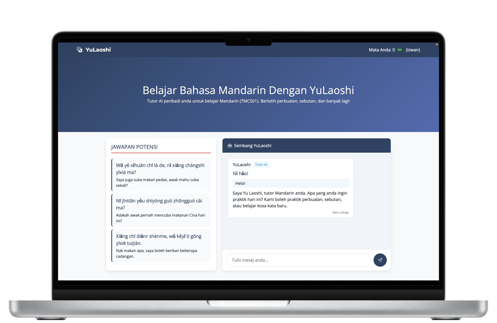
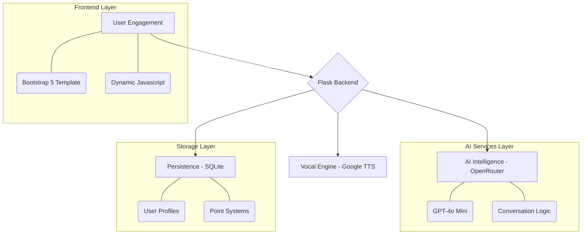

<div align="center">

# 🏮 YuLaoshi (宇老师)
### *Your Infinite AI Mandarin Companion*


[](https://izwan.pythonanywhere.com/)
[](https://github.com/izwanGit/LaoshiYu-Chatbot-/stargazers)
[](https://www.python.org/)
[](https://flask.palletsprojects.com/)

---

## 🖥️ System Showcase
**Experience a seamless, interactive journey into the Mandarin language.**



*A clean, modern, and intuitive interface designed for the next generation of language learners.*

---

</div>

## 🌟 Overview
**YuLaoshi** represents a leap forward in language education. It is not just a chatbot; it's a personalized tutor that understands the nuances of language learning. Built with **GPT-4o** via OpenRouter and powered by **Google's Neural TTS**, it bridges the gap between static textbooks and real-world conversation.

### 🚀 Core Pillars
*   **Contextual Intelligence:** Responds with Pinyin and Malay translations for every sentence.
*   **Crystal Clear Audio:** High-fidelity Mandarin pronunciation using neural speech engines.
*   **Gamified Growth:** A comprehensive point and badge system that rewards consistency.
*   **Smart Suggestions:** Stuck? The AI suggests what you should say next based on the chat history.

---

## 💎 Features in Detail

### 💬 1. Intelligent Chat Companion
The chatbot is fine-tuned to act as a **supportive Mandarin Sensei**. It doesn't just talk; it teaches.

| Capability | Technical Implementation | User Benefit |
| :--- | :--- | :--- |
| **Triple Response** | OpenRouter LLM parsing | Get Hanzi, Pinyin, and Malay in one go. |
| **Contextual Memory** | Session-based history management | The AI remembers what you talked about earlier. |
| **Auto-Suggestions** | Real-time context analysis | Never run out of things to say. |

### 🎯 2. The Listening Lab (Quiz)
A dynamic testing environment that uses AI to generate unique challenges.

| Test Type | Sound Engine | Objective |
| :--- | :--- | :--- |
| **Pinyin Mastery** | Google Neural TTS | Match the audio to the correct Pinyin representation. |
| **Comprehension** | High-Fidelity Audio | Understand the meaning of spoken Mandarin sentences. |
| **Instant Feedback** | Javascript Logic | Know your score immediately after the last question. |

---

## 🛠️ Technology Stack Detail

| Component | Technology | Role |
| :--- | :--- | :--- |
| **Language** | Python 3.10+ | Core application logic. |
| **Web Framework** | Flask 3.1 | Routing, API handling, and server management. |
| **Brain (LLM)** | GPT-4o (via OpenRouter) | Natural language understanding and generation. |
| **Vocal Engine** | gTTS | Converting Mandarin text into human-like audio. |
| **Database** | SQLite + SQLAlchemy | Storing user progress, points, and history. |
| **UI/UX** | Bootstrap 5 + Custom CSS | Responsive and aesthetic frontend design. |

---

## 🛠️ Technical Architecture



---

## 🎮 The Gamification Engine
Learning a language is a marathon. YuLaoshi makes it feel like a game.

### **Progression Tiers**
| Points | Badge Label | Rarity | Visual |
| :--- | :--- | :--- | :--- |
| **300+** | Mahaguru Mandarin! | 💎 Legendary | 🏆 |
| **200+** | Master Pinyin! | 🔴 Epic | ✨ |
| **100+** | Pencapaian Hebat! | 🟡 Rare | 💪 |
| **1+** | Pelajar Baru! | 🔵 Common | ⭐ |

### **Scoring Mechanics**
*   **Perfect Quiz Score:** +50 Points (Legendary Performance)
*   **Great Performance (70%+):** +25 Points (Advanced)
*   **Participation points:** Points awarded for active chatting and engagement.

---

## 📦 Project Structure
```bash
📂 LaoshiYu-Chatbot/
├── 📄 YuLaoshi.py           # Main application engine
├── 📄 requirements.txt       # Software dependencies
├── 📂 static/
│   ├── 📂 css/              # Styling & Visual tokens
│   ├── 📂 icons/            # Digital assets & emojis
│   └── 🎨 interface.png     # Application showcase image
├── 📂 templates/
│   ├── 🏠 index.html        # Main Chat Dashboard
│   └── 🎯 quiz.html         # Interactive Quiz Module
└── 🗄️ instance/             # Local database & state management
```

---

## ⚙️ Deployment & Setup

### **Local Development**
1. **Clone & Prep**
```bash
git clone https://github.com/izwanGit/LaoshiYu-Chatbot-.git
cd LaoshiYu-Chatbot-
python -m venv .venv && source .venv/bin/activate
pip install -r requirements.txt
```

2. **Launch**
```bash
python YuLaoshi.py
```

### **PythonAnywhere Hosting**
*   **WSGI Handling:** Configure your WSGI file to point to `YuLaoshi.py`.
*   **Environment:** Ensure `OPENAI_API_KEY` is set in your `app.env` or server config.
*   **Static Mapping:** Route `/static/` to your project's static folder.

---

## 💡 Future Roadmap
- [ ] **Voice Input:** Allow users to speak to YuLaoshi using their microphone.
- [ ] **HSK Tracking:** Align lessons with official HSK levels (HSK 1-3).
- [ ] **Leaderboard:** Compete with other students in real-time.
- [ ] **Mobile App:** Native Android/iOS version for learning on the go.

---

## 🙏 Special Dedication
This project is dedicated to **Yu Laoshi**, my Mandarin teacher for **TMC501**. 

In our classes, he always says: *"There's an AI for everything these days!"* 
But it made me wonder—why isn't there a dedicated AI for Mandarin? An AI for our specifically for our listening tests? An AI to make learning Mandarin truly interactive? 

That inspiration is why I created **YuLaoshi**. 🏮

---

## 👨‍💻 Developed By
**Muhammad Izwan bin Ahmad**  
*Universiti Teknologi MARA (UiTM), Kampus Tapah, Perak.*

---
<div align="center">
    <b>Built with ❤️ for Mandarin learners in Malaysia.</b>
    <br>
    <i>Turning language learning into an adventure.</i>
</div>
