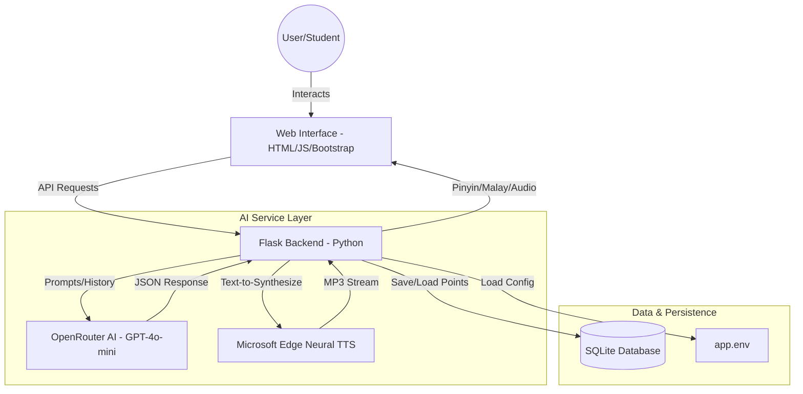

# 🏮 YuLaoshi: Your Premier AI-Powered Mandarin Tutor


> **"Bridging the language gap with AI, one Pinyin at a time."**

---

### 🌐 [Live Demo: Experience YuLaoshi Here](https://izwan.pythonanywhere.com/)

---

**YuLaoshi** is a cutting-edge educational platform designed to help Malaysian students (specifically for the TMC501 course) master Mandarin Chinese. By leveraging the latest in Generative AI and Neural Text-to-Speech, it provides a friendly, low-pressure environment for practicing conversation and listening comprehension.

---

## 🏗️ System Architecture

The following diagram illustrates how the frontend, backend, and external AI services interact:



---

## 🎯 Core Features & Functionality

| Feature | Description | Tech Used |
| :--- | :--- | :--- |
| **Intelligent Chatbot** | Personality-driven AI tutor that focuses on Pinyin and Malay translations. | OpenRouter (GPT-3.5/4) |
| **Listening Quiz** | Dynamically generated audio quizzes with human-like Mandarin voices. | GPT-4o + Edge TTS |
| **Neural TTS** | Professional-grade Mandarin pronunciation (Xiaoxiao voice). | `edge-tts` |
| **Gamification** | Points, levels, and badges system to keep students motivated. | SQLite + Javascript |
| **Responsive UI** | Mobile-first design that works on phones, tablets, and desktops. | Bootstrap 5 + CSS3 |
| **Smart Suggestions** | Context-aware response templates to help users continue chatting. | OpenAI Completion |

---

## 🏆 Gamification: Progression System

YuLaoshi is designed to be addictive. The more you learn, the higher you climb.

### 📊 Point Accumulation Logic (Quiz)
| Quiz Score (%) | Points Awarded | Bonus Label |
| :--- | :--- | :--- |
| **100% (Perfect)** | +50 Points | Exceptional! |
| **70% - 99%** | +20 Points | Great Work! |
| **30% - 69%** | +10 Points | Keep Practicing! |
| **< 30%** | +0 Points | Try Again! |

### 🏅 Achievement Badges
| Badge Name | Required Points | Color Theme |
| :--- | :--- | :--- |
| **Mahaguru Mandarin! 🏆** | 300+ | Purple (Master) |
| **Master Pinyin! ✨** | 200+ | Red (Advanced) |
| **Pencapaian Hebat! 💪** | 100+ | Yellow (Intermediate) |
| **Pelajar Baru! ⭐** | 1+ | Blue (Beginner) |

---

## 🛠️ Detailed File Structure

```text
LaoshiYu-Chatbot-/
├── YuLaoshi.py             # Main Flask Application (The "Brain")
├── app.env                  # Environment Variables (API Keys) - HIDDEN
├── requirements.txt         # List of Python dependencies
├── Procfile                 # Deployment instructions for PaaS (Heroku/Railway)
├── mandarin_learning.db     # SQLite Database (Auto-generated)
├── static/                  # Static Assets
│   ├── css/                 # Custom Styling & Bootstrap
│   ├── fonts/               # Web Fonts & Icons
│   ├── icons/               # User Interface Icons
│   └── images/              # Media Assets
├── templates/               # HTML Pages
│   ├── index.html           # Main Chat Interface
│   └── quiz.html            # Listening Quiz Page
└── instance/                # Flask instance-specific files
```

---

## � API Endpoints (Documentation)

### 1. Chat & AI
- `POST /chat`: Sends user message to AI and returns Pinyin/Translation.
- `GET /suggestions`: Returns 4 context-based Mandarin phrases for the user to pick.
- `POST /clear`: Resets the current user's conversation history.

### 2. Quiz & Voice
- `GET /generate_quiz`: Generates a randomized 5-question listening test.
- `GET /quiz_audio/<audio_data>`: Streams high-quality Neural MP3 audio for any Mandarin text.
- `POST /submit_quiz_result`: Processes score and updates user points in the database.

### 3. User Management
- `POST /create_or_update_user`: Initializes or retrieves a user profile.
- `GET /get_user_points`: Retrieves the current point balance for a user.

---

## 💻 Technical Setup & Deployment

### Local Development
1. **Prepare Environment**: `python -m venv .venv && source .venv/bin/activate`
2. **Install Packages**: `pip install -r requirements.txt`
3. **Set API Key**: Add your OpenRouter/OpenAI key to `app.env`.
4. **Launch**: `python YuLaoshi.py`

### PythonAnywhere Setup Flow
1. **GitHub Sync**: `git clone` your repo in the Bash console.
2. **Virtualenv**: Use `mkvirtualenv --python=/usr/bin/python3.10 myenv`.
3. **WSGI Config**: Point `application` to `from YuLaoshi import app as application`.
4. **Static Mapping**: Link `/static/` URL to your `static/` directory path.

---

## 🎓 Academic Context
*   **Course:** TMC501 (Mandarin II)
*   **Institution:** Universiti Teknologi MARA (UiTM), Tapah Campus.
*   **Developer:** Muhammad Izwan bin Ahmad (2024938885)
*   **Class:** A4CDCS2305A

---
**Disclaimer:** *The information provided by the AI is for educational practice. Always consult with your sensei/laoshi for academic evaluation.*
