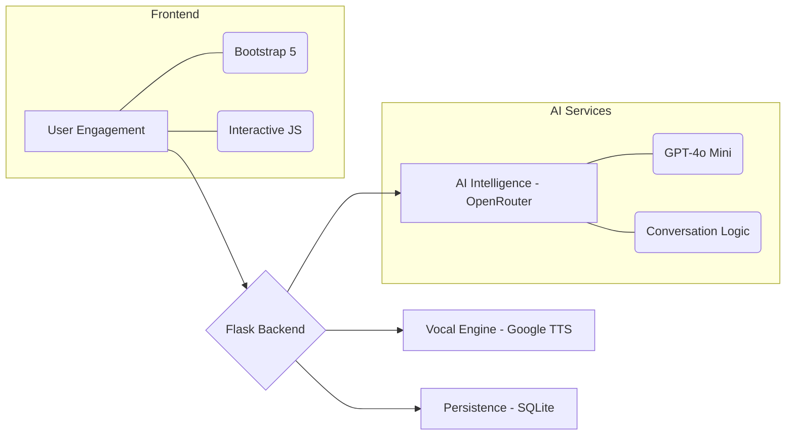

<div align="center">

# 🏮 YuLaoshi (宇老师)
### *Your Infinite AI Mandarin Companion*

[](https://izwan.pythonanywhere.com/)
[](https://github.com/izwanGit/LaoshiYu-Chatbot-/stargazers)
[](https://www.python.org/)

---

## 🖥️ System Showcase
**Experience a seamless, interactive journey into the Mandarin language.**


*A clean, modern, and intuitive interface designed for the next generation of language learners.*

---

</div>

## 🌟 Overview
**YuLaoshi** represents a leap forward in language education. It is not just a chatbot; it's a personalized tutor that understands the nuances of language learning. Built with **GPT-4o** via OpenRouter and powered by **Google's Neural TTS**, it bridges the gap between static textbooks and real-world conversation.

### 🚀 Core Pillars
*   **Contextual Intelligence:** Responds with Pinyin and Malay translations for every sentence.
*   **Crystal Clear Audio:** High-fidelity Mandarin pronunciation using neural speech engines.
*   **Gamified Growth:** A comprehensive point and badge system that rewards consistency.
*   **Smart Suggestions:** Stuck? The AI suggests what you should say next based on the chat history.

---

## 🛠️ Technical Architecture



---

## 🎮 The Gamification Engine
Learning a language is a marathon. YuLaoshi makes it feel like a game.

### **Progression Tiers**
| Points | Badge Label | Rarity | Visual |
| :--- | :--- | :--- | :--- |
| **300+** | Mahaguru Mandarin! | 💎 Legendary | 🏆 |
| **200+** | Master Pinyin! | 🔴 Epic | ✨ |
| **100+** | Pencapaian Hebat! | 🟡 Rare | 💪 |
| **1+** | Pelajar Baru! | 🔵 Common | ⭐ |

### **Scoring Mechanics**
*   **Perfect Quiz Score:** +50 Points
*   **Great Performance (70%+):** +25 Points
*   **Active Chatting:** Points awarded for meaningful interactions.

---

## 📦 Project Structure
```bash
📂 LaoshiYu-Chatbot/
├── 📄 YuLaoshi.py           # Core Logic & Routing
├── 📄 requirements.txt       # Dependencies
├── 📂 static/
│   ├── 📂 css/              # UI Frameworks
│   ├── 📂 icons/            # Interface Assets
│   └── 🎨 interface.png     # Application Showcase
├── 📂 templates/
│   ├── 🏠 index.html        # Chat Hub
│   └── 🎯 quiz.html         # Listening Lab
└── 🗄️ instance/             # Database & Local State
```

---

## ⚙️ Fast Setup

### **1. Clone & Prep**
```bash
git clone https://github.com/izwanGit/LaoshiYu-Chatbot-.git
cd LaoshiYu-Chatbot-
python -m venv .venv && source .venv/bin/activate
pip install -r requirements.txt
```

### **2. Launch**
```bash
python YuLaoshi.py
```
*App will be live at `http://127.0.0.1:5000`*

---

## ✍️ Author
**Muhammad Izwan bin Ahmad**  
*Universiti Teknologi MARA (UiTM), Kampus Tapah, Perak.*

---
<div align="center">
    <b>Built with ❤️ for Mandarin learners everywhere.</b>
</div>
